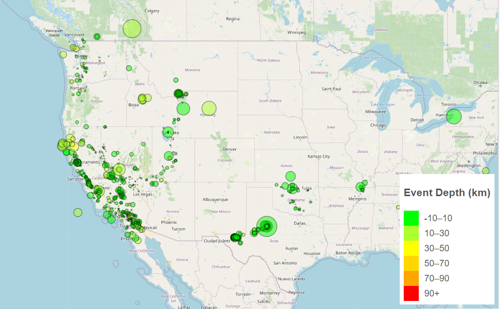
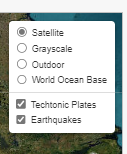
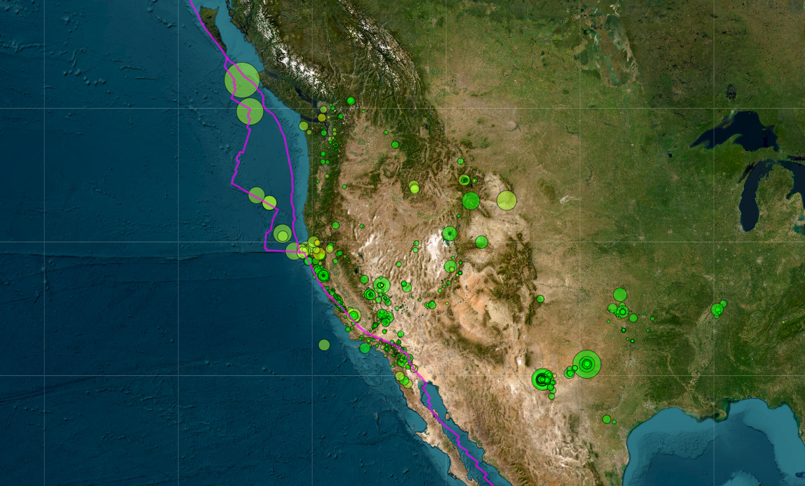
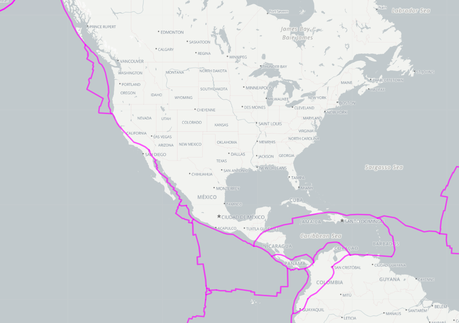

# **leaflet-challenge**
## Module 15 Challenge for UCI Data Analytics Bootcamp

## Vincent Passanisi

## Due February 6, 2023 Submitted February 19, 2023

# **Introduction**

The United States Geological Survey, or USGS for short, is responsible for providing scientific data about natural hazards, the health of our ecosystems and environment, and the impacts of climate and land-use change. Their scientists develop new methods and tools to supply timely, relevant, and useful information about the Earth and its processes.

The USGS is interested in building a new set of tools that will allow them to visualize their earthquake data. They collect a massive amount of data from all over the world each day, but they lack a meaningful way of displaying it. In this challenge, you have been tasked with developing a way to visualize USGS data that will allow them to better educate the public and other government organizations (and hopefully secure more funding) on issues facing our planet.

# **Files**

In the repository are the completed challenge files.

* *README.md* - ReadMe file for the project.
* *Leaflet-part-1* is the folder that holds part 1 of the challenge assignment
    * *index.html* is the html file for the challenge.
    * *static* folder contains the js folder and the css folder

* *Leaflet-part-2* is the folder that holds part 2 of the challenge assignment with the bonus exercise
    * *index.html* is the html file for the bonus.
    * *static* folder contains the js folder and the css folder

* *js* Folder - This folder contains the *logic.js* file and the data for the techtonic plates.

* *css* Folder - This folder contains *style.css* file for the *index.html* file

# **Results**

**DATASET RETRIEVAL**

Variables are created for today's date and the date two weeks prior. A query url is built and earthquake data is retrieved for the past two weeks.

**IMPORT AND DATA VISUALIZATION**

Using Leaflet, created a map that plots all the earthquakes from the dataset based on their longitude and latitude.

Data markers reflect the magnitude of the earthquake by their size and the depth of the earthquake by color. Earthquakes with higher magnitudes appear larger, and earthquakes with greater depth appear darker in color.

Popups are included that provide additional information about the earthquake when its associated marker is clicked.

A legend provides context for the map data by illustrating the color scale by depth.

**BONUS ASSIGNMENT**

I was able to complete the bonus assignment. The new map in the *Leaflet-Part-2* folder shows four different maps: satellite, grayscale, outdoor, and world ocean base. Markers are created as before, but the markers have been added to a control layer that can be turned on and off. In addition, techtonic plates have been added to a layer control which can also be turned on and off. It takes some time for the markers and plates to load. I'm not certain how to speed up my code.

Here are the controls:

This is the satellite map with all the markers:

And finally, the grayscale with just the techtonic plates and earthquake markers deselected:

# **Comments and Thoughts**

This challenge was probably one of the most difficult for me, along with the last one. JavaScript continues to elude me. I am still having difficulty understanding how best to structure the code. However, I learned a great deal from working with my team on group project 3. Understanding the role that the *style.css* file plays and how it works with the html file helped me to get my legend to show up on the map. Also, I was able to figure out on my own a way to get the dates right for my API call. I had a couple good tutor sessions that helped a lot, and Grace and Mark also helped me restructure my code to get my markers right.

I was able to complete the bonus section, and I almost got through it on my own. Spent a lot of time reading documentation and experimenting with structuring my code in different ways. My TA, Grace, helped me with my final issue. I got all my markers to show up, and the control appeared, but the markers did not disappear when deselected. It turns out the variable for the marker layer had to be outside the 'for' loop. We couldn't figure out why. The markers still take some time to load, and I'm not sure how to speed up the process. I learned a lot from this homework.

